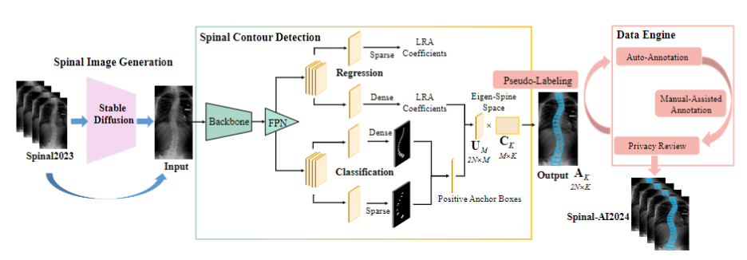

# <h1 align="center"> SG-LRA: Self-Generating Automatic Scoliosis Cobb Angle Measurement with Low-Rank Approximation</h1> 

<div align="center">
    
</div>

## Introduction

This is the official implementation of Paper: [SG-LRA: Self-Generating Automatic Scoliosis Cobb Angle Measurement with Low-Rank Approximation], which is built upon mmocr-0.2.1. SG-LRA is a framework with self-generative capabilities for automatic measurement of spinal scoliosis Cobb angles.

## Function

Reproducing the code will give you the following functions: <br>
Function 1. Ask SG-LRA to generate an X-ray image for you (based on the distribution characteristics of our private dataset Spinal2023), and you can continue to complete Function 3, or generate an entire dataset and continue to complete Function 4.<br>
Function 2. Provide a private spine X-ray dataset, train the generation module, and SG-LRA to generate X-ray images based on your own data features, continuing to complete Function 3 or Function 4.<br>
Function 3. Provide a private or SG-LRA generated spine X-ray image, and SG-LRA will automatically detect spinal landmarks, Cobb angles, and visualize the results. <br>
Function 4. Provide your private or SG-LRA generated unlabeled spine X-ray dataset, and SG-LRA will use the Data Engine proposed in the paper to generate relatively usable data annotations for the dataset.<br>
 
## Environment

Regardless of your specific needs, you will need to complete the following dependency installations. It is recommended to use a virtual [Anaconda](https://www.anaconda.com/) environment to manage your environment setup. Run the following commands to install dependencies.


```
conda create -n SG-LRA python=3.7 -y
conda activate SG-LRA
 conda install pytorch=1.8 torchvision cudatoolkit=11.1 -c pytorch -c nvidia -c conda-forge
pip install mmcv-full==1.3.9 -f https://download.openmmlab.com/mmcv/dist/cu111/torch1.8.0/index.html
pip install mmdet==2.14.0
git clone https://github.com/Ernestchenchen/SG-LRA
cd SG-LRA
pip install -r requirements.txt
python setup.py build develop
```

## Dataset

You have the following options for your spinal X-ray dataset:

Prepare your own private spinal X-ray dataset.
Download our open-source [Spinal-AI2024](https://anonymous.4open.science/r/Spinal-AI2024) dataset.
Additionally, our code provides sample data that can be used for testing purposes.


Please download and extract the above datasets into the `data` folder following the file structure below.
```
data
├─Spinal-AI2024
│  │ Spinal-AI2024_train.json
│  └─train
│  │ Spinal-AI2024_test.json
│  └─test
├─Your_Custom_Dataset
│  │ Your_Custom_train.json
│  └─train
│  │ Your_Custom_test.json
│  └─test
├─sample_data
│  │ sample_data_train.json
│  └─train
```

## Function1
Before executing the instructions, you need to place the images or dataset in the /original-X-ray folder, and wait for the output results from the /generation-X-ray folder.
```
python .\x-ray_generate\xray_test_noinput.py
```

## Function2
You may need to re-adjust the weight file paths or re-initialize the weights to obtain weights that are suitable for your own dataset.
```
python .\x-ray_generate\train_unet_only_Xray_Pipeline.py
```

## Function3
```
CUDA_VISIBLE_DEVICES=0 python tools/test.py configs/spinal_det.py work_dirs/spinal_det/latest.pth --eval hmean-e2e
```

## Function4
```
CUDA_VISIBLE_DEVICES=0 ./tools/train.py configs/spinal_det.py  --work-dir work_dirs/spinal_det
```


## Acknowledgement
We sincerely thank [MMOCR](https://github.com/open-mmlab/mmocr) for their excellent works.
